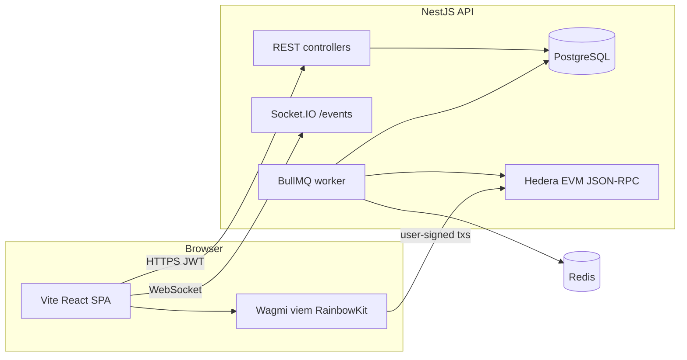
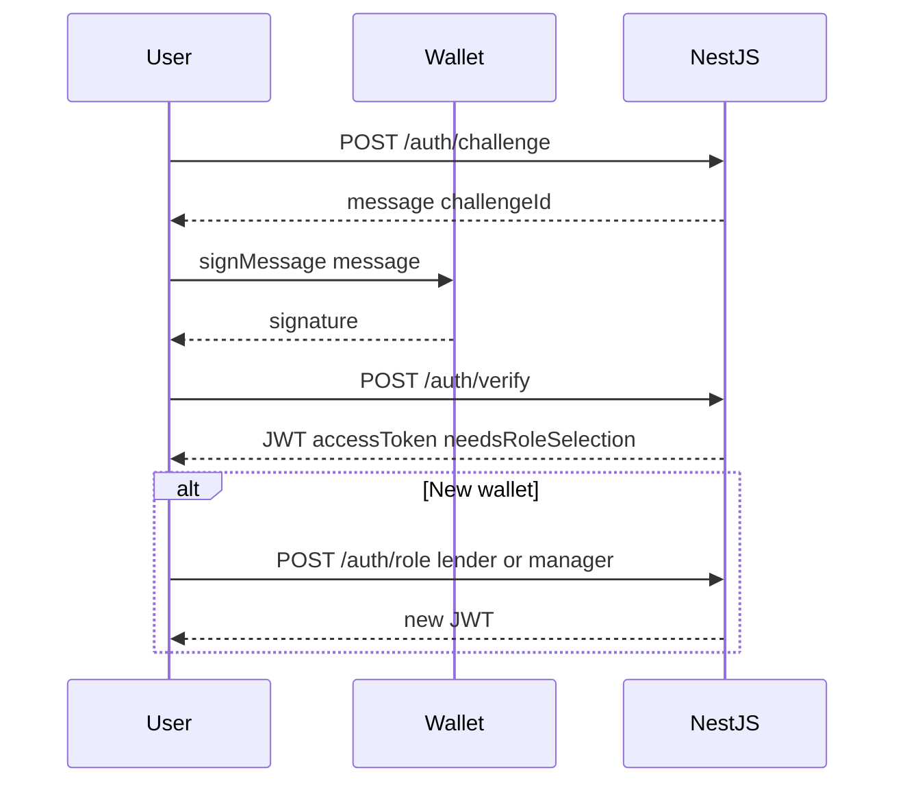

# OneYield

**OneYield** is an institutional-style **real-world asset (RWA) lending and pool management** web application built for **Hedera EVM**. The UI is a Vite + React single-page app; the API is **NestJS** with **PostgreSQL**, **Redis**, **BullMQ**, and **Socket.IO**. Users operate in four roles—**borrower**, **lender**, **pool manager**, and **platform admin**—with different authentication paths and dashboards.

An earlier product brief ([`.lovable/plan.md`](.lovable/plan.md)) described a mock-only prototype. **This repository is the full-stack implementation**: real JWT sessions, REST APIs, queued on-chain execution for platform keys, wallet-signed flows in the browser, and live UI refresh over WebSockets.

---

## Table of contents

1. [Architecture](#architecture)
2. [Authentication and sessions](#authentication-and-sessions)
3. [How on-chain actions sync with the backend](#how-on-chain-actions-sync-with-the-backend)
4. [User flows by role](#user-flows-by-role)
5. [Features and API surface](#features-and-api-surface)
6. [Frontend (tech stack and structure)](#frontend-tech-stack-and-structure)
7. [Backend (tech stack and structure)](#backend-tech-stack-and-structure)
8. [Data stores](#data-stores)
9. [Environment variables](#environment-variables)
10. [Local setup](#local-setup)
11. [Running the project](#running-the-project)
12. [Tests and quality](#tests-and-quality)
13. [Production deployment](#production-deployment)
14. [Repository layout](#repository-layout)
15. [Smart contracts](#smart-contracts)

---

## Architecture

At a high level, the browser talks to the NestJS API over HTTPS and opens a Socket.IO connection to the **`/events`** namespace on the same origin you configure as the WebSocket base. The API persists state in PostgreSQL, enqueues platform-signed transactions through BullMQ (Redis), and uses **ethers** against a Hedera-compatible JSON-RPC endpoint (default **Hashio** testnet in [`backend/src/config/configuration.ts`](backend/src/config/configuration.ts)).



---

## Authentication and sessions

The app supports **two complementary auth models** (see [`backend/src/auth/auth.controller.ts`](backend/src/auth/auth.controller.ts) and [`src/contexts/WalletContext.tsx`](src/contexts/WalletContext.tsx)).

### Credential users (borrower and bootstrap admin)

- **Register**: `POST /auth/register` with username, password, profile fields, and role `borrower` | `lender` | `manager` (registration flow on the landing page primarily uses **borrower**).
- **Login**: `POST /auth/login` returns JWT **access** token (and refresh behavior is handled via `POST /auth/refresh`—see [`src/lib/api.ts`](src/lib/api.ts) interceptors).
- **Admin user**: On API startup, [`AuthService.onModuleInit`](backend/src/auth/auth.service.ts) ensures a user `admin` exists and syncs password from `ADMIN_PASSWORD` when configured ([`backend/.env.example`](backend/.env.example)).

Access tokens are stored in `localStorage` under `oneyield_jwt` and sent as `Authorization: Bearer`.

### Web3 users (lender and pool manager)

- **Challenge**: `POST /auth/challenge` with `walletAddress` returns a short-lived **message** and `challengeId`.
- **Verify**: The wallet signs the message (via Wagmi `signMessage`); the client sends `POST /auth/verify` with `walletAddress`, `challengeId`, and `signatureHex`. The server uses `ethers.verifyMessage` and issues a JWT.
- **First-time role**: New wallet users get `needsRoleSelection: true` in the JWT until they call `POST /auth/role` with `lender` or `manager`.

### Username availability

- `GET /auth/username-available?username=...` supports registration UX on the landing page.



### Frontend route protection

[`ProtectedRoute`](src/App.tsx) requires a connected wallet or valid session, and—when the API is configured— a JWT unless `VITE_USE_MOCK_WALLET=true` or the API base URL is unset (mock mode). See [Environment variables](#environment-variables).

---

## How on-chain actions sync with the backend

There is **no separate Mirror Node indexer service** wired in [`AppModule`](backend/src/app.module.ts). State reconciliation uses:

1. **`POST /pools/record-activity`** — Records intent / manual activity tied to the authenticated user (used from hooks such as [`useLenderActions`](src/hooks/useLenderActions.ts), [`useManagerActions`](src/hooks/useManagerActions.ts), [`useBorrowerWeb3Actions`](src/hooks/useBorrowerWeb3Actions.ts)).
2. **`POST /pools/confirm-tx`** — After a transaction is mined, the client sends the **tx hash** and a **type** (plus optional `poolId`, `v1PoolId`, `draftId`) so the backend can update PostgreSQL and align with chain state ([`PoolsController`](backend/src/pools/pools.controller.ts)).
3. **BullMQ `TxProcessor`** — Jobs submitted with platform signer keys (factory, oracle, etc.) run **sequentially** (`concurrency: 1`) to reduce nonce collisions; on completion, [`EventsGateway`](backend/src/websocket/events.gateway.ts) emits `tx` so the UI refetches data ([`useEventsSocket`](src/hooks/useEventsSocket.ts)).

The frontend loads API configuration before render via [`initApiFromRuntime`](src/main.tsx) (reads build-time env and optional `/api-config.json` in production).

---

## User flows by role

Routes are defined in [`src/App.tsx`](src/App.tsx).

### Borrower

1. Open `/` ([`LandingPage`](src/pages/LandingPage.tsx)).
2. **Register** or **login** with username/password → JWT with role `borrower`.
3. Redirect to `/borrower` (dashboard), `/borrower/pools`, `/borrower/pools/:poolId` (detail), and `/borrower/history`.
4. **Create pool** (`POST /pools`, borrower JWT): submits pool parameters and optional compliance file; workflow continues with admin-side draft review and on-chain deployment from the admin portal where applicable.
5. **Allocations**: `PATCH /pools/:id/allocations` for child-pool allocation rules.
6. **Borrower wallets**: `GET/POST/PATCH/DELETE /borrower/wallets` to map token addresses to borrower EVM addresses for on-chain actions.
7. **Repay**: Backend route `POST /borrower/repay`; UI may also drive wallet flows and confirm via `confirm-tx` / `record-activity` depending on the feature ([`useRepay`](src/hooks/useRepay.ts), [`useBorrowerWeb3Actions`](src/hooks/useBorrowerWeb3Actions.ts)).

### Lender

1. Connect wallet (RainbowKit: MetaMask, Rainbow, Coinbase, optional WalletConnect when `VITE_WALLETCONNECT_PROJECT_ID` is set).
2. Complete **challenge → verify**; if required, pick **lender** on first visit.
3. Use `/lender`, `/lender/pools`, `/lender/portfolio`, `/lender/history`.
4. Deposits/withdrawals: wallet-signed transactions on Hedera EVM, then **`record-activity`** / **`confirm-tx`** to sync the backend.

### Pool manager

1. Same Web3 auth as lender; choose **manager** at role selection.
2. Use `/manager`, `/manager/pools`, `/manager/history`.
3. **Pool lifecycle**: `POST /pools/:id/activate`, `pause`, `unpause`; **deploy funds** `POST /pools/:id/deploy-funds`; **send to reserve** `POST /pools/:id/send-to-reserve`; **child pools** under `POST|PATCH|DELETE /pools/:id/child-pools/...`; **borrower wallets** `GET /pools/:id/borrower-wallets`.

### Admin

1. **Login** as `admin` with password from `ADMIN_PASSWORD`.
2. Routes: `/admin`, `/admin/pools/:id`, `/admin/pool-drafts`, `/admin/pool-drafts/:draftId`.
3. **Draft APIs**: `GET /admin/pool-drafts`, `GET /admin/pool-drafts/:id`, file download `GET /admin/pool-drafts/:id/file`.
4. **Manual oracle run** (optional): `POST /admin/oracle/run-aum-update` ([`OracleController`](backend/src/oracle/oracle.controller.ts)) — same logic as the scheduled job; requires oracle signer env and admin JWT.

---

## Features and API surface

Below is a concise map from **capability** to **HTTP API**. All routes except public auth and health are protected by JWT unless noted; role guards apply as implemented on each controller.

| Area | Routes / entrypoints | Notes |
|------|----------------------|--------|
| Health | `GET /health` | [`HealthController`](backend/src/health.controller.ts) |
| Auth | `POST /auth/challenge`, `POST /auth/verify`, `POST /auth/role`, `POST /auth/login`, `POST /auth/register`, `GET /auth/username-available`, `POST /auth/refresh` | [`AuthController`](backend/src/auth/auth.controller.ts) |
| Pools (public list) | `GET /pools`, `GET /pools/constants/tokens`, `GET /pools/:id`, `GET /pools/:id/transactions`, `GET /pools/:id/on-chain` | Listing and read-only pool data |
| Borrower pool create | `POST /pools` (multipart: pool fields + optional file) | `Roles: borrower` |
| Allocations | `PATCH /pools/:id/allocations` | `borrower` |
| Manager pool ops | `POST /pools/:id/activate` \| `pause` \| `unpause` \| `deploy-funds` \| `send-to-reserve` | `manager` |
| Activity + confirm | `POST /pools/record-activity`, `POST /pools/confirm-tx` | Authenticated; drives DB ↔ chain consistency |
| Child pools | `POST /pools/:id/child-pools`, `PATCH ...`, `DELETE ...` | `manager` |
| Borrower dashboard | `GET /borrower/dashboard/summary`, `GET /borrower/dashboard/active-pools`, `GET /borrower/pools` | `borrower` |
| Borrower wallets | `GET/POST/PATCH/DELETE /borrower/wallets` | `borrower` |
| Borrower repay & history | `POST /borrower/repay`, `GET /borrower/transactions` | `borrower` |
| Lender | `GET /lender/positions`, `GET /lender/transactions`, `GET /lender/performance` | `lender` |
| Manager summary | `GET /manager/aum`, `GET /manager/pools`, `GET /manager/transactions` | `manager` or `admin` |
| Admin pools & drafts | `GET /admin/pools`, `GET /admin/pool-drafts`, `GET /admin/pool-drafts/:id`, `GET /admin/pool-drafts/:id/file` | `admin` |
| Oracle (manual) | `POST /admin/oracle/run-aum-update` | `admin`; cron also runs [`OracleService`](backend/src/oracle/oracle.service.ts) |
| Realtime | Socket.IO namespace `/events` | Events `tx` (and gateway supports `indexer` payload name for future use) |

**Screening**: [`ScreeningModule`](backend/src/screening/screening.module.ts) integrates a **Chainalysis-oriented stub**; set `CHAINALYSIS_API_KEY` when wiring a real provider ([`backend/.env.example`](backend/.env.example)).

**Rate limiting**: Global [`ThrottlerModule`](backend/src/app.module.ts) (default **100 requests / 60s** per IP); some pool and borrower routes use stricter `@Throttle` limits.

---

## Frontend (tech stack and structure)

| Layer | Choice |
|-------|--------|
| Runtime | React 18, TypeScript |
| Build | Vite 5 ([`vite.config.ts`](vite.config.ts)) |
| Styling | Tailwind CSS, shadcn/ui patterns, Radix primitives |
| Routing | React Router v6 ([`src/App.tsx`](src/App.tsx)) |
| Server state | TanStack Query |
| Web3 | Wagmi 2, viem, RainbowKit ([`src/App.tsx`](src/App.tsx)); target chain from [`src/lib/wagmi-target-chain.ts`](src/lib/wagmi-target-chain.ts) (`VITE_NETWORK=mainnet` → Hedera mainnet, else testnet) |
| HTTP | Axios with JWT + refresh ([`src/lib/api.ts`](src/lib/api.ts)) |
| Realtime | socket.io-client ([`src/hooks/useEventsSocket.ts`](src/hooks/useEventsSocket.ts)) |
| Charts | Recharts |
| Forms / validation | react-hook-form, zod |
| Tests | Vitest; Playwright available as dev dependency |

**Important env name**: The app reads **`VITE_NETWORK`** for Wagmi chain selection and UI network label. If you use a local file, set `VITE_NETWORK=testnet` or `mainnet` (see [Environment variables](#environment-variables)).

**Key directories**

- [`src/pages/`](src/pages/) — Role dashboards, admin, landing, history, 404.
- [`src/components/`](src/components/) — UI components, modals, layout.
- [`src/contexts/`](src/contexts/) — `WalletProvider`, transaction overlay, etc.
- [`src/hooks/`](src/hooks/) — Web3 actions per role, repay, sockets.
- [`src/lib/`](src/lib/) — API client, env resolution, chain constants.

---

## Backend (tech stack and structure)

| Layer | Choice |
|-------|--------|
| Framework | NestJS 10 |
| ORM | TypeORM → **PostgreSQL** ([`backend/src/app.module.ts`](backend/src/app.module.ts)) |
| Queue | BullMQ + **Redis** ([`backend/src/queue/`](backend/src/queue/)) |
| Auth | `@nestjs/jwt`, Passport JWT strategy, bcrypt for password hashes |
| Validation | class-validator / class-transformer |
| Web3 | ethers v6 in contract/queue layer ([`backend/src/contracts/`](backend/src/contracts/)) |
| Scheduling | `@nestjs/schedule` (oracle cron) |
| WebSockets | `@nestjs/platform-socket.io` ([`backend/src/websocket/`](backend/src/websocket/)) |
| Tests | Jest (`npm run test`, `npm run test:e2e`) |

**Production note**: TypeORM **`synchronize`** is enabled only when `NODE_ENV !== 'production'` ([`app.module.ts`](backend/src/app.module.ts)). For production, use migrations or a controlled schema strategy—do not rely on synchronize.

**Main modules** (see [`app.module.ts`](backend/src/app.module.ts)): `AuthModule`, `PoolsModule`, `ContractsModule`, `QueueModule`, `OracleModule`, `WebsocketModule`, `ScreeningModule`.

Short API-focused notes also live in [`backend/README.md`](backend/README.md).

---

## Data stores

- **PostgreSQL** — Pools, drafts, borrower pool links, transaction records, lender positions, AUM history, queue job audit rows, contract registry, users, borrower wallet mappings (entities registered in [`app.module.ts`](backend/src/app.module.ts)).
- **Redis** — BullMQ connection for the `hedera-tx` (and related) workers.

---

## Environment variables

### Frontend ([`.env.example`](.env.example) → copy to `.env.local`)

| Variable | Purpose |
|----------|---------|
| `VITE_API_URL` | Backend origin (e.g. `http://localhost:3001`). If empty, API calls are disabled unless you rely on relative `/api-config.json` after deploy. |
| `VITE_WS_URL` | Socket.IO base; defaults logically to API URL in [`src/lib/api-env.ts`](src/lib/api-env.ts). |
| `VITE_NETWORK` | `mainnet` vs default testnet for Wagmi + UI (`VITE_HEDERA_NETWORK` in `.env.example` is legacy naming—**use `VITE_NETWORK`** to match [`wagmi-target-chain.ts`](src/lib/wagmi-target-chain.ts)). |
| `VITE_MIRROR_NODE_URL` | Mirror node REST (explorers / read helpers where used). |
| `VITE_FACTORY_CONTRACT_ADDRESS`, `VITE_POOL_TOKEN_ADDRESS`, `VITE_RPC_URL`, etc. | Override defaults in [`src/lib/chain-constants.ts`](src/lib/chain-constants.ts). |
| `VITE_WALLETCONNECT_PROJECT_ID` | Enables WalletConnect in RainbowKit when set. |
| `VITE_USE_MOCK_WALLET` | `true` bypasses JWT requirement in [`ProtectedRoute`](src/App.tsx) for local UI work. |
| `VITE_EVM_CHAIN_ID` | Optional chain id override ([`src/lib/blockchain/metamask.ts`](src/lib/blockchain/metamask.ts)). |

### Backend ([`backend/.env.example`](backend/.env.example))

| Variable | Purpose |
|----------|---------|
| `PORT` | API port (default **3001**). |
| `CORS_ORIGIN` | Browser origin(s) allowed; comma-separated or `*`. |
| `DATABASE_URL` **or** host/user/password/name | PostgreSQL connection. |
| `REDIS_URL` **or** `REDIS_HOST` / `REDIS_PORT` | Redis for BullMQ. |
| `JWT_SECRET`, `JWT_EXPIRES_IN`, `JWT_REFRESH_*` | JWT signing and refresh policy. |
| `RPC_URL`, `FACTORY_ADDRESS`, pool token / role addresses | Blockchain config ([`configuration.ts`](backend/src/config/configuration.ts)); aligns with `FACTORY_CONTRACT_ID` naming in `.env.example` for legacy scripts. |
| `*_PRIVATE_KEY` platform keys | `PLATFORM_ADMIN`, `ROLE_MANAGER`, `POOL_MANAGER`, `ORACLE`, `FM_ADMIN`, etc.—**never commit**; use secrets manager in production. |
| `ADMIN_PASSWORD`, `ADMIN_SEED_UPDATE_PASSWORD` | Bootstrap admin user. |
| `ORACLE_CRON` | Cron for scheduled AUM updates (default `30 0 * * *` UTC). |
| `CHAINALYSIS_API_KEY` | Optional screening integration. |

---

## Local setup

1. **Node.js** — **20.x** recommended (matches [`Dockerfile`](Dockerfile) and CI-friendly builds).
2. **Infra** — From repo root: `docker compose up -d` to start **PostgreSQL 16** and **Redis 7** ([`docker-compose.yml`](docker-compose.yml)).
3. **Frontend env** — `cp .env.example .env.local` and set `VITE_API_URL` / `VITE_WS_URL` to `http://localhost:3001` for full-stack dev.
4. **Backend env** — `cp backend/.env.example backend/.env` and set DB/Redis to match Docker defaults (`oneyield` / `oneyield` user-password and DB name unless you changed them).
5. **Install** — `npm install` at repo root **and** `cd backend && npm install`.

---

## Running the project

### Development (two terminals)

**Terminal A — API**

```bash
cd backend
npm run start:dev
```

- Listens on `http://localhost:3001` ([`main.ts`](backend/src/main.ts)).
- Health: `GET http://localhost:3001/health`.

**Terminal B — SPA**

```bash
npm run dev
```

- Vite dev server: [`vite.config.ts`](vite.config.ts) uses port **8080** by default.
- Set backend `CORS_ORIGIN=http://localhost:8080` (already default in `.env.example`).

### Production-style frontend build (local)

```bash
npm run build
npm run preview
```

### Docker image (frontend static hosting)

The root [`Dockerfile`](Dockerfile) builds the Vite app and runs [`serve-static.mjs`](serve-static.mjs) on `0.0.0.0:$PORT`, exposing **`GET /api-config.json`** so production can inject `VITE_API_URL` / `VITE_WS_URL` at **runtime** if they were missing at build time.

---

## Tests and quality

| Scope | Command |
|-------|---------|
| Frontend unit tests | `npm run test` |
| Frontend lint | `npm run lint` |
| Backend unit tests | `cd backend && npm run test` |
| Backend e2e | `cd backend && npm run test:e2e` |

Manual testnet checklist: [`docs/E2E-TESTNET.md`](docs/E2E-TESTNET.md).

---

## Production deployment

### Frontend (Railway / container)

- **Build args**: Pass `VITE_API_URL` and `VITE_WS_URL` as Docker build arguments so Vite embeds them (see [`Dockerfile`](Dockerfile)). Prefer **literal `https://...` URLs**; Railway’s `${{ service.RAILWAY_PUBLIC_DOMAIN }}` may not resolve during Docker build—see [`railway.env.example`](railway.env.example).
- **Runtime**: `serve-static.mjs` serves `/api-config.json` from `process.env` for clients that missed build-time vars.
- **502 troubleshooting**: Logs should show `[static] listening on http://0.0.0.0:...`. If you see nginx instead of Node, the platform may be using a cached or wrong Dockerfile—redeploy without stale cache (documented in `railway.env.example`).

### Backend

- Set `DATABASE_URL` (e.g. Railway Postgres plugin), `REDIS_URL`, `CORS_ORIGIN` to your **frontend origin** (not `*` in strict production if you can avoid it), and all **signer keys** via the provider’s secret store.
- Ensure `NODE_ENV=production` so TypeORM does not auto-synchronize schema unless you intend it.

### `frontend/` directory

[`frontend/README.md`](frontend/README.md) explains that if Railway **Root Directory** is mistakenly set to `frontend`, a stub exists so the build can still reference the repo-root Dockerfile. **Preferred**: root directory empty, build from repository root.

---

## Repository layout

| Path | Purpose |
|------|---------|
| [`src/`](src/) | React application |
| [`backend/src/`](backend/src/) | NestJS application |
| [`docker-compose.yml`](docker-compose.yml) | Local Postgres + Redis |
| [`docs/`](docs/) | Additional checklists |
| [`serve-static.mjs`](serve-static.mjs) | Production static file + `/api-config.json` server |
| [`frontend/`](frontend/) | Railway root-directory workaround only |

---

## Smart contracts

Solidity sources and deployment scripts live in a **separate repository** (referenced in older docs as `oneYield-contracts`). This app expects deployed **factory** and pool-related contracts on Hedera EVM; configure **`FACTORY_ADDRESS` / `FACTORY_CONTRACT_ID`**, token addresses, and RPC URL to match your deployment.

---

## License and security

- Backend package license field: see [`backend/package.json`](backend/package.json).
- **Never commit** private keys or production JWT secrets. Rotate `ADMIN_PASSWORD` and JWT secrets for any public deployment.
